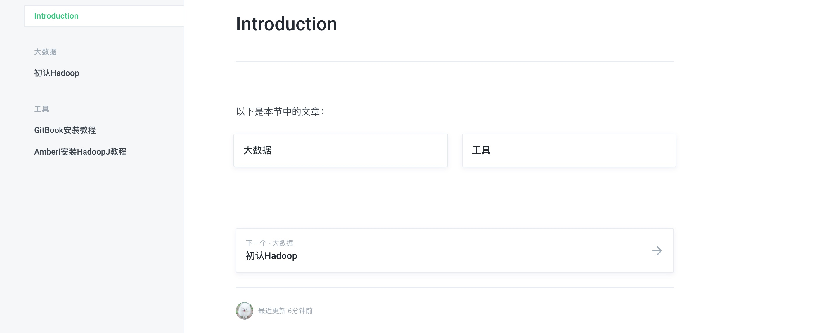

####手把手教你不花一分钱搭建个人博客网站
本片文章会详细介绍使用GitHub+GitBook方式搭建属于自己的个人知识管理博客。**真**不花一分钱：依托GitBook平台同步GitHub搭建个人博客
#### GitBook是什么
  在说GitBook不得先说GitHub。GitHub相比大家都不陌生，GitHub是现在世界上主流的开源项目源码云托管平台。可以非常方便的管理团队协同管理不同版本，不同开发人员的不同需求。
  而GitHub不仅是程序员们管理代码的工具，它可以应该用在各种需要多人员协作的场景中。
现在我们说回GitBook，虽然都是**”Git“**开头，但GitBook主要是基于 Markdown 和 AsciiDoc 两种文档语法，

#### 真不花一分钱：GitBook+GitHub搭建个人博客
##### GitHub注册地址如下 [点击跳转](https://github.com/join?ref_cta=Sign+up&ref_loc=header+logged+out&ref_page=%2F&source=header-home)

##### GitBook官往地址如下[点击跳转](https://app.gitbook.com/join)

##### 登录GItBook创建一个新空间

##### 创建公开/私人项目

##### 点击创建进入初始界面

##### 进入GitHub新建项目[点击进入创建页面](https://github.com/new)


#####下载Git图形界面管理工具SourceTree [点击跳转官方网站下载](https://www.sourcetreeapp.com/)

#####打开SouceTree

#####使用SourceTree添加GitHub账号或OAuth协议授权


#####GitHub HTTPS协议克隆项目


####下面就是重头戏了
##### 在gitbook_test目录下创建如下

```shell
### GitBook默认加载文件
README.md      
### GitBook默认加载文件 如果不配置.gitbook.yaml 默认使用
SUMMARY.md     


##下面属于自定义环节
### Content目录存储模流
Content
### image目录存储文章
image

### .gitignore 管理不提交文件
cat .gitignore  
   .DS_Store   --文件名为.DS_Store 隐藏文件不会提交到GitHub中
   

```

##### 自定义配置GitBook目录结构（修改 .gitbook.yaml）
```shell

#用于定位内容的根目录
#默认值是存储库的根目录。
root: ./
 
# Files to use as SUMMARY/README.
#（相对于<root>目录）
structure:
  # 描述：使用 README.md文件内容
  readme: README.md
  # 概要：使用 SUMMARY.md文件内容
  summary: SUMMARY.md
 
#将URL重定向到特定文件（相对于<root>目录）
redirects: new-folder/page.md
```
##### SUMMARY.md

```markdown

# 破鱼的小屋
##大数据
* [初认Hadoop](Content/chapter3.md)

## 工具
* [GitBook安装教程](Content/chapter98.md)
* [Amberi安装HadoopJ教程](Content/chapter99.md)

```
##### SUMMARY.md 效果如下

#### 使用SourceTree提交修改


#### 在GitBook授权GitHub项目


#### 在分享中找到你的项目外网地址

#### 我们就可以尽情访问了


#### GitHub修改手动跟新


